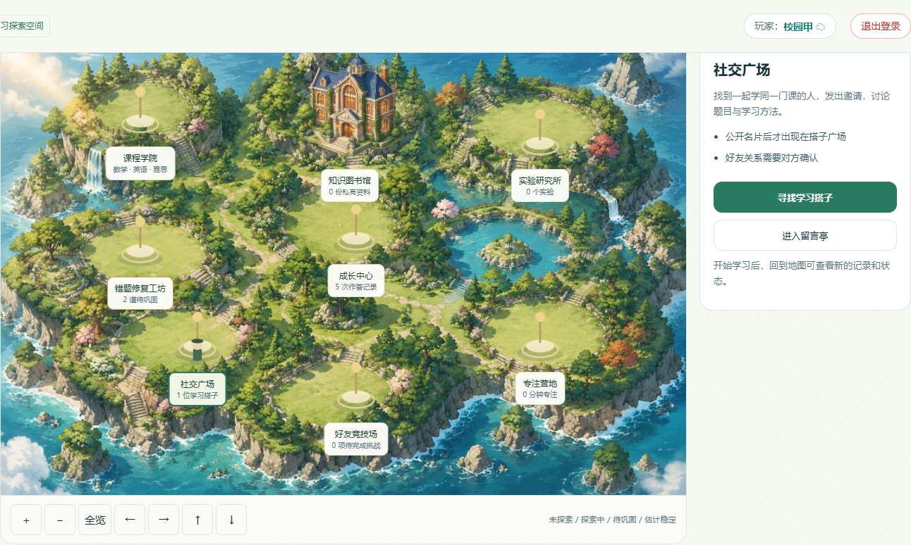

# 学无忧 · 校园互动版

[](https://render.com/deploy?repo=https://github.com/Dallovers/xuewuyou)

完整后端部署见 [部署与队友分享](部署与队友分享.md)。免费方案使用 Render 后端＋Neon PostgreSQL，配置 DATABASE_URL 后，账号、留言、挑战、学习记录与上传资料保存到数据库。免费后端会休眠，首次访问可能需要约一分钟。详见 [免费后端搭建指南](免费后端搭建指南.md)。



以用户确认的 [Dallovers/xuewuyou](https://github.com/Dallovers/xuewuyou) `main` 为基础，基线提交 `fb98d7118906b982cd5c1745d9d7dd69251e0885`（2026-09-09）。保留原生页面、题库、自习室、错题本和学习资料，以及已接入的智能复习、课程问答、文档解析、知识图、自动排程、BKT 掌握度、数学实验室和题目白板。新增 Phaser 等距校园地图、课程地图、章节关卡与真实学习状态同步。

首页 8 个分区对应课程学院、知识图书馆、实验研究所、社交广场、好友竞技场、专注营地、错题修复工坊和成长中心。已接入你提供的手绘海岛底图和透明图书馆；尚未提供建筑素材的分区使用地点标记。课程地图包含 14 个实际模块；数学模块进入专属章节地图。每个分区可以配置多个入口，后续增加功能无需重画底图。

新增学习搭子、校园留言与题目讨论、异步五题好友挑战。通过 Socket.IO 接收邀请与挑战更新通知，通过 markdown-it 排版留言；挑战由服务器判分并同步原答题记录、错题本和 FSRS。作答、专注、成果与互动数量会在地图同步后更新；可以继续使用原来的列表页面。

[校园互动与 GitHub 选型](校园互动与GitHub选型.md) 说明开源选择和双账号演示步骤；[地图美术素材指南](地图美术素材指南.md) 给出继续生图与替换步骤；[地图设计与开源参考](地图设计与开源参考.md) 说明状态映射。当前属于学习状态孪生原型，地图没有测绘真实校园，BKT 使用未校准的固定参数估计。

## 启动网站

需要 Node.js 22.12 或更新版本，以及 Python 3.10–3.14。Windows 下双击 **启动网站.cmd**：首次安装 Node 依赖和独立的 Python 学习引擎，并在没有 `.env` 时从模板创建配置。首次安装需要联网；项目包已带本地地图、白板和数学实验室静态资源。也可手动运行：

```powershell
cd server
Copy-Item .env.example .env # 仅首次，没有已有配置文件时执行
npm ci
npm run vendor:math # 项目包已带资源时可跳过；源码缺少数学资源时执行
powershell -NoProfile -ExecutionPolicy Bypass -File ../services/Setup-Learning.ps1
npm start
```

打开 **http://localhost:3000**，注册或登录云端账号。端口在 `server/.env` 中修改。通过 Node 服务打开网站；双击 `index.html` 或部署到 GitHub Pages 无法运行后端功能。

**学习搭子、留言、好友挑战，以及知识图、排程、掌握估计、数学实验、白板、智能复习和 TXT/MD 预览，都无需外部模型密钥。** Socket.IO 使用网站同一端口，无需额外部署服务。OR-Tools / pyBKT 使用本机 Python 虚拟环境；数学实验的 Python 在浏览器里运行。课程问答需要 RAGFlow，PDF/Office/图片解析需要 MinerU；未配置时页面明确显示状态。

## 操作路径和功能

| 接入 | 操作路径 | 实际行为 |
| --- | --- | --- |
| [Socket.IO](https://github.com/socketio/socket.io) 4.8.4 | 社交广场 → 学习搭子；好友竞技场 | 邀请、好友与挑战更新通知，公开名片在线状态；使用现有登录和同一 Node 服务 |
| [markdown-it](https://github.com/markdown-it/markdown-it) 15.0.2 | 社交广场 → 留言亭；练习或复盘 → 题目讨论 | Markdown、数学公式、回复和作者删除；讨论按题号隔离 |
| [Phaser](https://github.com/phaserjs/phaser) 4.2.1 | 校园地图 → 课程探索区 → 数学模块 → 章节地点 | 等距地图、地点选择、角色移动、缩放与查看；真实学习状态同步；可替换手动生图素材 |
| [ts-fsrs](https://github.com/open-spaced-repetition/ts-fsrs) 5.4.2 | 题库产生错题 → 错题本「按复习计划重做错题」或导航「智能复习」 | 到期队列、提交答案与熟练程度、计算下次时间、保存调度日志 |
| [RAGFlow](https://github.com/infiniflow/ragflow) | 学习资料「上传课程资料并提问」或导航「课程问答」 → 上传 → 等待索引 → 提问 | 每人独立知识库，选定资料范围，返回引用片段；模型未配置时返回检索依据 |
| [MinerU](https://github.com/opendatalab/MinerU) 4.x V1 | 课程问答 → 上传 PDF、DOCX、PPTX 或图片 → 查看文本 | 上传源文件、创建解析任务、限时轮询、取得 Markdown、交给 RAGFlow 建索引 |
| 本地 [KaTeX](https://katex.org/docs/browser) 0.19.0 | 复习题干、选项和解析 | 保留公式内容进行排版，无需外部公式 CDN |
| [Cytoscape.js](https://github.com/cytoscape/cytoscape.js) 3.34.3 | 导航「学习工作台」→ 知识地图 | 25 个真实题库主题、课程过滤、先修箭头、缩放、错题统计、点击节点或主题按钮开始练习 |
| [OR-Tools](https://github.com/google/or-tools) 9.15.6755 | 学习工作台 → 备考计划 → 填写日期、学习窗口、课表占用 → 生成 | 真实 CP-SAT 求解；到期错题和薄弱点优先，避开占用，先修主题优先；保留已完成任务，时间不足明确列出；导出 ICS |
| [pyBKT](https://github.com/CAHLR/pyBKT) 1.4.3 | 答客观题 → 学习工作台「更新学情」 | 贝叶斯知识追踪估计、样本量、下一题答对概率；FSRS 日志与前端镜像去重、自评题排除 |
| [Pyodide](https://github.com/pyodide/pyodide) 314.0.7 | 学习工作台 → 数学实验室 | 运行可编辑 Python；NumPy / SymPy / Matplotlib 本地资源；求导、积分、矩阵、概率模拟、出图；保存、重开、复现、导出代码和图片 |
| [Excalidraw](https://github.com/excalidraw/excalidraw) 0.18.1 | 题库练习或智能复习 →「题目白板」；地图主题 →「打开白板」 | 绘图、自由笔、文本、图片和撤销；按账号及题号保存；关闭自动保存，重新打开恢复；PNG 导出；版本冲突保护 |

复习与好友挑战中的选择题由服务器用原题库标准答案判定，客观复习答错强制按「不会」调度。证明题等明确标为自评。客观复习与挑战提交同步回原学情记录；主观自评不会被当成机器判分。快答题补齐稳定题号与答案快照，避免不同快答错题合并成一条。

## 校园互动演示

用两个浏览器或一个普通窗口和一个无痕窗口注册不同账号 → 社交广场公开搭子名片 → 按课程找到同学 → 邀请并由对方接受 → 发起五题挑战 → 双方分别开始并交卷 → 查看服务器分数与用时 → 展开解析、进入题目讨论或打开白板 → 回到地图查看新增作答和错题。

挑战允许双方在不同时间完成，每人开始后限时 15 分钟，整场有效期 24 小时。双方交卷后才展示完整解析和双方成绩；先比较答对数，再比较用时。留言支持校园公共讨论与专属题目讨论。当前专注营地仍为原个人自习室；地图人物代表当前用户，没有实现多人同屏角色或实时对战。

## 学习工作台使用说明

建议演示路径：答几道题 → 更新学情 → 查看主题掌握估计 → 输入备考时间生成计划 → 进入专项练习 → 在题目白板保留推导 → 把同一道题关联到数学实验室，修改代码核对计算 → 保存实验与导出草稿。

- BKT 使用固定参数：先验 0.2、学习概率 0.1、猜测概率 0.25、失误概率 0.1、遗忘概率 0。参数未用真实学生群体校准，页面中的概率是模型估计，不是考试成绩或已验证预测准确率。少于 5 次客观作答显示样本较少；未作答主题显示未评估，不伪造掌握度。
- 只统计题库内有标准选项答案的客观题，以及其 FSRS 客观复习；不把证明题、自评题、未知题号计为客观正误。历史范围受原网站保留记录数量限制。
- 知识关系为人工课程先修关系，配置在 `server/learning/topics.js`；可按教师授课顺序修改。地图和同等操作的主题按钮都可打开练习。
- 计划最多 30 天，每天最多 4 小时；课表占用手动填写。每项 20 分钟、相邻起点相隔 25 分钟。任务从到期错题和主题练习生成；一个计划中每个任务最多安排一次，重新排程保留已完成项及其时段。复习日期按北京时间，ICS 使用 UTC 时间，日历软件会转换为本地时间。
- 数学实验只在浏览器工作线程执行，服务器仅保存结果快照。运行最多 20 秒，可停止死循环并重新初始化。首次加载的环境准备时间单独计算；限制输出 10 万字符、3 张图，每个实验最多 2 MB，每人最多 50 个实验。
- 白板按题号绑定原题库，最多 1500 个元素、20 张图片、2 MB。保存失败会保留打开的白板以便重试或导出；其他窗口覆盖版本会提示冲突。切换账号清理页面中的上一账号内容。

数学库已包含在 `vendor/pyodide/`，浏览器无需访问 Python CDN。地图和白板按需加载，题库首页不会载入 React 或 Python 运行时。重新构建白板时执行 `cd widgets/whiteboard; npm ci; npm run build`。修改了间接依赖的版本覆盖以修复已知问题，版本由 lockfile 固定。

Linux/macOS 手动环境：`python3 -m venv services/learning/.venv`，然后使用该环境的 `bin/pip install -r services/learning/requirements.txt`；安装 Node 依赖并 `npm start`。也可在 `.env` 设置 `LEARNING_PYTHON` 为已有环境的绝对路径。

## 启动 RAGFlow

安装并启动 Docker Desktop / WSL2，在项目根目录运行：

```powershell
powershell -NoProfile -ExecutionPolicy Bypass -File services/Setup-RAGFlow.ps1
```

脚本下载官方默认分支并使用上游 Compose，控制台端口改为 8088，部分数据库端口也调整以减少冲突。镜像、硬件和模型要求以 [官方部署说明](https://github.com/infiniflow/ragflow#-quick-start) 为准。

1. 打开 **http://127.0.0.1:8088**，创建账号，配置可用的 Embedding 模型并设为默认。
2. 在 RAGFlow 控制台创建 API Key。
3. 在 `server/.env` 填写以下内容后重启网站：

```dotenv
RAGFLOW_BASE_URL=http://127.0.0.1:9380
RAGFLOW_API_KEY=你的本地密钥
```

已上传的「文本已解析」资料可点「重试」建立索引。网站自动为每个云端账号创建 Dataset，无需先建立聊天助手；使用 [Dataset / Retrieval HTTP API](https://ragflow.io/docs/http_api_reference)。服务启动后仍需完成 Embedding 模型配置才能检索。

## 启动 MinerU

需要 Python 3.10–3.14，在另一个终端运行：

```powershell
powershell -NoProfile -ExecutionPolicy Bypass -File services/Start-MinerU.ps1
```

脚本创建虚拟环境，安装 `mineru>=4,<5`，启动本机 8000 端口 V1 API。默认 Basic，首次 PDF/图片解析可能下载模型；Office 按官方接口使用 Flash 层。硬件、引擎和模型要求见 [官方 SDK/API 说明](https://opendatalab.github.io/MinerU/usage/sdk_api/)。

在 `server/.env` 填写后重启网站：

```dotenv
MINERU_BASE_URL=http://127.0.0.1:8000
MINERU_TIER=basic
MINERU_API_KEY=
```

若使用解析服务密钥，在启动 MinerU 的终端设置同一个 `MINERU_API_KEY` 并填写到网站 `.env`。地址是 `/v1` 之前的根地址；本版不使用旧 `/file_parse`。文件上传目的地必须与配置服务同源。

## 配置 AI 回答与原有 AI 助手

在 `server/.env` 配置后重启：

```dotenv
AI_PROVIDER=zhipu
AI_API_KEY=你的本地密钥
AI_BASE_URL=
AI_MODEL=
```

`AI_BASE_URL` 是 `/chat/completions` 之前的地址，`AI_MODEL` 为实际可用模型名称。可使用兼容接口的本地或云端模型。没有模型密钥时，FSRS、解析、检索依据仍能使用，不会假装生成回答。原有 AI 统一经后端调用，已移除前后端内置密钥及浏览器直连回退。原仓库公开过的内置密钥若仍在使用，应到服务商撤销或轮换。

## 数据和复用

- 默认数据目录 `server/data`，保留原账号和学习数据结构。新增卡片、日志和资料元数据存入 `integrations.json`，源文件存入 `uploads/<用户编号>/`。重启保留数据。
- 白板、计划和实验存入同一数据目录下的 `learning.json`，按账号隔离。迁移时连同账号和其他数据文件一起备份；原 FSRS 的导出按钮不包含这个新文件。用户可直接导出白板 PNG、实验 Python/PNG 与计划 ICS。
- 搭子名片、邀请、好友关系、留言和挑战存入 `community.json`。名片默认不公开；好友请求需对方确认。互动数据和账号、学习记录需要一起备份，FSRS 导出不包含互动数据。
- 「智能复习 → 导出记录」下载自己的调度日志、资料文本和元数据 JSON，适合展示与分析；不是一键恢复包，不含原文件或模型密钥。
- TXT/MD 使用 UTF-8；每份不超过 8 MB，解析文本不超过 30 万字符，每人最多 50 份资料。删除同时移除远端索引和本地源文件。
- 引用指向解析后的文档和检索片段，本版未实现原 PDF 页码映射。失败可重试，索引重试复用远端文档编号。
- JSON 存储适合单进程演示和小规模使用；多进程需迁移数据库与持久任务队列。重启中断的解析任务变为可重试。
- 后端适配在 `server/integrations/`，页面在 `js/integrations.js`、`css/integrations.css`；可复用到其他课程场景。依赖版本锁定在 `server/package-lock.json`。

## 验证范围

2026-10-08，Windows / Node.js 24.17 / Python 3.14.6 / Edge：

- `cd server; npm test`：29 项测试通过，覆盖真实 FSRS、pyBKT 贝叶斯更新、CP-SAT 排程、成果与账号隔离、校园状态聚合及资料接入；新增互动测试验证显式邀请确认、Socket.IO 身份与通知隔离、按题回复、服务器判分、提交幂等、限时和重启后的学习记录补写。
- `npm run check`：入口和新增页面脚本语法检查通过。
- 浏览器完成登录同步、客观题复习、下次时间保存、UTF-8 资料上传与预览；桌面和 375/390 px 手机页面无横向溢出。
- 新浏览器流程实测知识地图与 BKT 显示、白板真实绘图/保存/重开/PNG 导出、计划勾选/日历导出、Pyodide 求导/积分/函数出图、实验保存重开、死循环停止与重新运行、实际题库工具入口。375/390 px 地图、计划、实验页面无横向溢出，无页面脚本异常或本地资源失败。
- 校园浏览器流程验证真实 Phaser Canvas 渲染、8 个功能建筑、14 个课程模块、课程过滤、章节进入原题库、缩放、键盘选择、地图说明、列表视图、手机导航与 375/390 px 无溢出；新增作答自动同步到状态快照，退出登录清除云端快照。截图与结果见 `previews/atlas-browser-check.json`。
- 两个独立浏览器账号完成公开名片、实时邀请、好友确认、公式留言和回复、同一组五题挑战与按题讨论；实际服务器判分 3/5 与 5/5，并验证新增 5 次作答、2 道错题和地图搭子数量。375/390 px 三个互动页无横向溢出，退出登录清理互动表单与私有结果。见 `previews/community-browser-check.json`。
- 学习引擎安装脚本已在 Windows PowerShell 5.1 验证；新增三种计算引擎均实际运行。
- server 和白板依赖 `npm audit` 均未发现已报告漏洞。
- **RAGFlow、MinerU 和模型联调使用本地模拟服务，不代表已完成真实模型推理。** 当前机器没有 Docker，未启动真实 RAGFlow，未安装 MinerU 模型。代码和脚本已准备，真实服务启动后仍需模型联调。

截图和浏览器记录在 `previews/`。完整项目目录保留原仓库资料 PDF 和音频。
